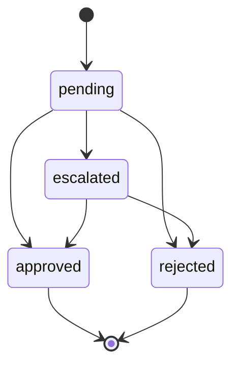

# ECONEURA · Control plane de IA para empresas 

**Gestiona IA sobre tu <sistema>. No sustituimos ERP/CRM.**

[](#)
[](#)
[](#)
[](#)
[](#)
[](#)

ECONEURA opera agentes de IA sobre tus sistemas actuales con gobierno integrado:
HITL, DLP, RLS, FinOps y evidencias. Enfoque UE, auditable y con costes
previsibles. Este README describe el **estado objetivo final al 100 por
ciento**.

---

## TLDR

- Orquestamos IA **sobre** ERP, CRM y HRIS existentes.
- Cockpit con **10 áreas** y **5 agentes por área**.
- Gobierno completo: **HITL, DLP, RLS, FinOps y OTel**.
- **CI/CD verde**, **coverage consolidado ≥ 90/80**, **UI p95 < 2 s**, **API p95
  < 1500 ms**.

---

## Demo local en VS Code

`ash corepack enable pnpm -v || npm i -g pnpm@8.15.5 pnpm -w install
--frozen-lockfile pnpm -C apps/web dev

# VS Code → View: Simple Browser → http://localhost:3000

``

> Mensaje fijo en UI: **Gestiona IA sobre tu <sistema>. No sustituimos
> ERP/CRM.**

---

## Qué es

- **Cockpit web**: sidebar por área, grid de agentes, consumo IA, KPIs, timeline
  y chat por área.
- **Agentes**: ejecución con barra de progreso, ETA, uso de tokens, coste
  estimado y registro de actividad.
- **Gobierno**: aprobaciones HITL, políticas DLP, RLS por tenant y límites
  FinOps con hard-stop.
- **Observabilidad**: métricas y trazas OTel de extremo a extremo con alertas de
  salud.

---

## Arquitectura

`mermaid flowchart LR   User-->Cockpit[apps/web (React)]   Cockpit--->API[apps/api (proxy IA)]   API--PG-->DB[(Postgres + RLS)]   API--OIDC-->AAD[(Azure AD OIDC)]   API--Cache-->KV[(KV/Redis)]   API--OTLP-->OTel[(OTel Collector)]   API--Make-->Make[Make.com]   API--Models-->LLM[(Modelos on-prem y cloud)]   OTel-->Apm[(App Insights/Tempo/Grafana)] `

---

## Cockpit: capacidades clave

- **Navegación** por áreas: CEO, IA, CSO, CTO, CISO, COO, CHRO, CGO, CFO, CDO.
- **Agentes por área**: estado, progreso, ETA, consumo IA, botones **Ejecutar**,
  **Pausar**, **Conectar Make**.
- **KPIs rápidos** y **timeline** con eventos ok, warn, err.
- **Chat contextual** por área con sugerencias y accesibilidad ARIA.
- **Consumo IA** visible: tokens, EUR estimado, llamadas.

Capturas recomendadas:

- docs/img/cockpit.png
- docs/img/hitl.png
- docs/img/finops.png

---

## Gobierno operativo

### HITL (Human In The Loop)

`mermaid stateDiagram-v2   [*] --> pending   pending --> approved   pending --> rejected   pending --> escalated   escalated --> approved   escalated --> rejected   approved --> [*]   rejected --> [*] `

- Reglas por criticidad y confidencialidad.
- Auditoría completa: marca temporal, usuario, motivo y artefacto.
- SLA de aprobación por rol y reintentos controlados.

### DLP (Data Loss Prevention)

- Detección: NIF, DNI, IBAN, email personal y dominios restringidos.
- Acciones: enmascarado, bloqueo, allowlist con justificación.
- Políticas por tenant y canal, evidencias exportables.

### RLS (Row Level Security)

- Aislamiento por tenant a nivel de BD.
- Scopes por rol: lectura, ejecución, auditoría.

### FinOps

- Presupuestos por tenant y agente, límites diario y mensual con **hard-stop**.
- **EUR por tarea p95**, **fallback ratio** y variaciones de consumo.
- Alertas por cuota alcanzada y desviaciones.

---

## Observabilidad y SLO

- Export **OTLP** a App Insights o backend OTel.
- **X-Correlation-Id** en API, workers y agentes.
- Dashboards listos: latencia p95, error rate, throughput, consumo IA.
- Alertas activas:
  - API p95 > 1500 ms
  - 5xx > 5 por minuto
  - Disponibilidad < 100 por ciento
  - Desviación FinOps > umbral

---

## API (estado final)

`GET  /v1/health                         -> { status } POST /v1/chat                           -> { text, usage } POST /v1/agents/:id/run                 -> 202 + { correlationId } GET  /v1/usage?tenant=:id               -> consumo por agente y tenant GET  /v1/hitl/requests                  -> lista paginada POST /v1/hitl/:id/approve|reject        -> decisión auditada GET  /v1/dlp/events?tenant=:id          -> eventos DLP`

Headers: Authorization: Bearer, X-Route, X-Correlation-Id.

---

## Calidad y CI/CD

- Coverage consolidado: **Statements ≥ 90 por ciento**, **Functions ≥ 80 por
  ciento**.
- Lint sin warnings, typecheck estricto, artefactos reproducibles.
- E2E crítico: **UI p95 < 2 s**, **error rate < 1 por ciento**.
- Workflows:
  - ci.yml: lint + build + test + coverage + artefactos.
  - deploy.yml: despliegue a Azure App Service.
  - elease.yml: versión y changelog automatizados.

Comandos útiles:

`ash pnpm -C apps/web lint --max-warnings 0 pnpm -C apps/web typecheck pnpm -C apps/web test:coverage pnpm -C apps/api test:coverage `

---

## Seguridad UE

- Datos procesados y almacenados en la UE.
- TLS 1.2 o superior, cifrado en tránsito y en reposo.
- Minimización de datos y **RLS** por tenant.
- Auditoría de accesos a PII y decisiones HITL.
- Sin secretos en cliente. Proxy de IA del lado servidor.

---

## Guía de desarrollo

1. Instalar dependencias con pnpm.
2. Arrancar pps/web y validar que **AI_ENDPOINT** proxyea a la API.
3. Revisar dashboards OTel y alertas en APM.
4. Ejecutar lint, typecheck y cobertura antes de abrir PR.

Estructura abreviada:

`apps/   web/   # Cockpit   api/   # Proxy IA + gobierno policies/   # DLP, HITL, FinOps por tenant db/         # Esquemas y RLS otel/       # Colección y export openapi/    # Especificación API scripts/    # Automatización CI/FinOps docs/       # Capturas y guías`

---

## Áreas y agentes

- **CEO**: NEURA-CEO, Agenda Consejo, Anuncio Semanal, Resumen Ejecutivo Diario,
  Seguimiento OKR.
- **IA**: NEURA-IA, Chequeo de Salud y Failover, Cost Tracker, Revisión de
  Prompts, Vigilancia de Cuotas.
- **CSO**: NEURA-CSO, Gestor de Riesgos, Radar de Tendencias, Sincronización de
  M&A, Vigilancia Competitiva.
- **CTO**: NEURA-CTO, FinOps Cloud, Observabilidad y SLO, Gestión de
  Incidencias, Seguridad CI/CD.
- **CISO**: NEURA-CISO, Vulnerabilidades y Parches, Phishing Triage,
  Backup/Restore DR, Recertificación de Accesos.
- **COO**: NEURA-COO, Atrasos y Excepciones, Centro NPS/CSAT, Latido de SLA,
  Torre de Control.
- **CHRO**: NEURA-CHRO, Encuesta de Pulso, Offboarding Seguro, Onboarding
  Orquestado, Pipeline de Contratación.
- **CGO**: NEURA-CGO, Calendario de Contenidos, Campañas Email, Lead Scoring +
  Enriquecimiento, Ads ROI Optimizer.
- **CFO**: NEURA-CFO, Dunning Inteligente, Gasto Anómalo, MRR/ARR Ledger,
  Pronóstico de Caja 30/90.
- **CDO**: NEURA-CDO, Calidad de Datos, Gobernanza/Privacidad (GDPR), Registro
  Accesos PII, Catálogo y Linaje.

---

## FinOps: métricas y controles

- **EUR por tarea p95** por agente y tenant.
- **Fallback ratio** por proveedor/modelo.
- **Cuotas** con hard-stop y alertas por variación.
- **Panel** de coste diario y mensual con previsión.

---

## Roadmap → Completado

# ECONEURA · Control plane de IA para empresas

**Gestiona IA sobre tu <sistema>. No sustituimos ERP/CRM.**

[](https://github.com/ECONEURA/ECONEURA-/actions/workflows/ci.yml)


ECONEURA orquesta agentes de IA **sobre** tus sistemas actuales con gobierno
operativo completo: **HITL, DLP, RLS, FinOps y observabilidad OTel**. EU-first,
auditable y con costes controlados.

---

## Por qué ECONEURA

- **Sobre tu stack**: integramos IA sin reemplazar ERP, CRM ni HRIS.
- **Gobierno desde el día 0**: HITL, DLP y auditoría incorporados por diseño.
- **FinOps medible**: control por agente y **EUR por tarea p95** con cuotas y
  hard-stop.
- **EU-first**: datos en la UE, RLS por tenant, cifrado en tránsito y reposo.
- **Time-to-Value < 7 días**: cockpit, agentes y flujos listos para pilotar.

---

## Qué incluye

- **Cockpit web** con 10 áreas ejecutivas y **60 agentes** listos para conectar
  a tu stack y a Make.com.
- **Chat por área**, atajos de análisis y registro de actividad.
- **KPIs rápidos** y **timeline** con eventos ok, warn, err.
- **Controles FinOps**: consumo por agente, EUR estimado, límites y alertas.
- **HITL** con estados pending, approved, rejected y escalado.
- **DLP** con detección de PII, enmascarado y allowlists justificadas.
- **Observabilidad OTel** end-to-end y SLOs recomendados.

---

## Arquitectura

```mermaid
flowchart LR
  User-->Cockpit[apps/web (React)]
  Cockpit--->API[apps/api (proxy IA)]
  API--PG-->DB[(Postgres + RLS)]
  API--OIDC-->AAD[(Azure AD OIDC)]
  API--Cache-->KV[(KV/Redis opcional)]
  API--OTLP-->OTel[(OTel Collector)]
  API--Make-->Make[Make.com]
  API--Models-->LLM[(Modelos on-prem y cloud)]
  OTel-->APM[(App Insights / Tempo / Grafana)]
```

---

## Cockpit

- **Navegación** por áreas: CEO, IA, CSO, CTO, CISO, COO, CHRO, CGO, CFO, CDO.
- **Tarjetas de agente**: estado activo o en ejecución, barra de progreso, ETA,
  consumo IA, acciones Ejecutar/Pausar/Conectar Make.
- **NEURA ejecutivo** por área: chat contextual con atajos “Resumen del día”,
  “Top riesgos”, etc.
- **Accesibilidad**: roles ARIA, foco visible, hotkeys (`/` buscar, `O`
  organigrama).
- **Marca**: “Gestiona IA sobre tu <sistema>. No sustituimos ERP/CRM.”

Coloca capturas reales en:

- `docs/img/cockpit.png`
- `docs/img/hitl.png`
- `docs/img/finops.png`

---

## Gobierno operativo

### HITL



- Reglas por criticidad y confidencialidad.
- Auditoría: timestamp, actor, motivo, artefacto.
- SLA por rol con reintentos controlados.

**Evento HITL (ejemplo)**

```json
{
  "id": "hitl_3f1b",
  "tenant": "acme-eu",
  "agent": "NEURA-CFO:Dunning",
  "state": "pending",
  "input": { "invoiceId": "INV-2025-0091" },
  "risk": { "pii": false, "financial": true, "level": "medium" },
  "createdAt": "2025-10-04T14:22:10Z",
  "correlationId": "c-7b9a-1d"
}
```

### DLP

- Detecciones: NIF/DNI, IBAN, emails personales, dominios restringidos.
- Acciones: enmascarado, bloqueo, allowlist con justificación.
- Políticas por tenant y por canal con export de evidencias.

**Política DLP (ejemplo)**

```json
{
  "tenant": "acme-eu",
  "channels": ["chat", "batch"],
  "matchers": ["DNI", "IBAN", "EMAIL_PERSONAL"],
  "actions": {
    "mask": true,
    "block": ["IBAN"],
    "allowlist": ["dominio-corporativo.es"]
  },
  "audit": true
}
```

### RLS

- Aislamiento por tenant en DB.
- Scopes por rol: lectura, ejecución y auditoría.

### FinOps

- Presupuestos por tenant y por agente.
- Límites diarios y mensuales con **hard-stop**.
- Métricas: **EUR por tarea p95** y **fallback ratio** por proveedor/modelo.
- Alertas de cuota y de desviación de consumo.

**Límites FinOps (ejemplo)**

```json
{
  "tenant": "acme-eu",
  "agent": "NEURA-IA:Cost-Tracker",
  "limits": { "dailyEUR": 50, "monthlyEUR": 900 },
  "alerts": { "variancePct": 25, "quotaPct": [80, 100] },
  "actionOnBreach": "HARD_STOP"
}
```

---

## Observabilidad y SLO

- Export **OTLP** a App Insights, Tempo o backend OTel compatible.
- **X-Correlation-Id** en API, workers y agentes.
- Dashboards: latencia p95, tasa de error, throughput, consumo IA.
- **X-Correlation-Id** en API, workers y agentes.

**SLOs recomendados**

- API p95 < 1500 ms
- UI p95 < 2000 ms
- error rate < 1%
- disponibilidad = 100% en producción

---

## APIs principales

```
GET  /v1/health                         -> { "status": "ok" }
POST /v1/chat                           -> { "text": "...", "usage": {...} }
POST /v1/agents/:id/run                 -> 202 + { "correlationId": "..." }
GET  /v1/usage?tenant=:id               -> consumo por agente y tenant
GET  /v1/hitl/requests                  -> lista paginada
POST /v1/hitl/:id/approve|reject        -> decisión auditada
GET  /v1/dlp/events?tenant=:id          -> eventos DLP
```

**Ejemplos**

```bash
curl -s -H "Authorization: Bearer $TOKEN" -H "X-Correlation-Id: c-1" https://api.econeura.eu/v1/health
curl -s -H "Authorization: Bearer $TOKEN" -H "Content-Type: application/json" \
  -d '{"model":"gpt-4o-mini","messages":[{"role":"user","content":"Resumen del dia"}]}' \
  https://api.econeura.eu/v1/chat
```

---

## Demo local en VS Code

```bash
corepack enable
pnpm -v || npm i -g pnpm@8.15.5
pnpm -w install --frozen-lockfile
pnpm -C apps/web dev
# VS Code → View: Simple Browser → http://localhost:3000
```

**Configuración rápida**

- `AI_ENDPOINT`: apunta a tu proxy de servidor para IA.
- Modelo por defecto en la API.
- Sin secretos en el cliente.

---

## Calidad y CI/CD

- **Coverage consolidado**: statements ≥ 90%, functions ≥ 80%.
- **Lint** sin warnings, **typecheck** estricto, artefactos reproducibles.
- **E2E** con Playwright. **UI p95 < 2 s**.

**Workflows**

- `ci.yml`: lint + build + test + coverage + artefactos.
- `deploy.yml`: despliegue a Azure App Service.
- `release.yml`: versionado y changelog automático.

**Comandos**

```bash
pnpm -C apps/web lint --max-warnings 0
pnpm -C apps/web typecheck
pnpm -C apps/web test:coverage
pnpm -C apps/api test:coverage
```

---

## Seguridad y cumplimiento UE

- Datos en la UE. TLS ≥ 1.2. Cifrado en tránsito y reposo.
- Minimización de datos y RLS por tenant.
- Auditoría de accesos a PII y decisiones HITL.
- Evaluaciones periódicas de riesgo y export de evidencias.
- Proxy seguro del lado servidor. Sin secretos en cliente.

---

## ICP y casos de uso

**ICP**: organizaciones UE con ERP/CRM/HRIS consolidados, múltiples fuentes de
datos y requisitos regulatorios. **Casos**

- CEO/COO: torre de control, SLA, OKR.
- CISO/CTO: vulnerabilidades, observabilidad, CI/CD seguro.
- CFO: tesorería, desviaciones, cobros.
- CDO: calidad, linaje, catálogo.
- CGO/Comercial: pipeline, campañas, post-campaña.

---

## Diferenciadores

- Gobierno de extremo a extremo desde el primer día.
- Métricas operativas y FinOps nativos.
- Integraciones Make/Azure y opción on-prem para modelos.
- Sin lock-in. Diseñado para coexistir con tu stack.

---

## Roadmap breve

- Integraciones Make y Azure listas para producción.
- Cuotas y alertas FinOps runtime por agente.
- MSAL y RBAC por rol y área.
- Dashboards OTel y documentación de SLO.
- Benchmarks por sector en EUR por tarea p95 y calidad.

---

## Contribución

- Ramas: `feat/*`, `fix/*`, `chore/*`.
- PR con: cambios, riesgos HITL/FinOps, capturas, cobertura y p95.
- Estilo: ESLint y Prettier, commits convencionales, cero warnings.

---

## FAQ

**¿Sustituye mi ERP o CRM?** No, orquestamos IA **sobre** tu stack. **¿Dónde se
procesan los datos?** En la UE, según despliegue acordado. **¿Qué modelos usa?**
Cloud u on-prem, sin lock-in de proveedor. **¿Cómo controlo costes?** Límites
por agente y tenant, **EUR por tarea p95** y alertas.

---

## Licencia

Apache 2.0 o Business Source con anexo de uso responsable.

---

**ECONEURA** · **Gestiona IA sobre tu <sistema>. No sustituimos ERP/CRM.** CI
re-trigger: 2025-10-05T16:12:58Z
