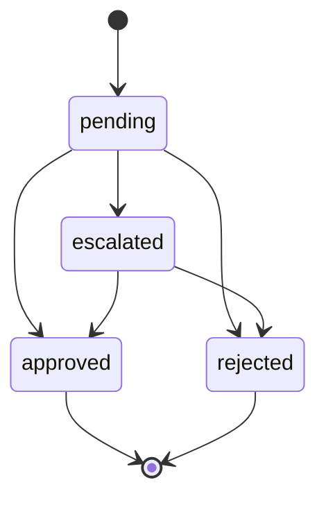

````markdown
# ECONEURA · Control plane de IA para empresas (GA 100%)
**Gestiona IA sobre tu <sistema>. No sustituimos ERP/CRM.**

[](#)
[](#)
[](#)
[](#)
[](#)
[](#)

ECONEURA opera agentes de IA sobre tus sistemas actuales con gobierno integrado: HITL, DLP, RLS, FinOps y evidencias. EU-first, auditable y con costes previsibles. Esta versión describe el **estado final al 100%**.

---

## TLDR
- Orquestación de IA **sobre** ERP/CRM/HRIS existente.
- Cockpit con **10 áreas** y **5 agentes por área** (incluye NEURA ejecutivo).
- Gobierno operativo: **HITL, DLP, RLS, FinOps, OTel**.
- **CI/CD verde**, cobertura consolidada **>= 90/80**, **UI p95 < 2 s**, **API p95 < 1500 ms**.

---

## Demo local en VS Code
```bash
corepack enable
pnpm -v || npm i -g pnpm@8.15.5
pnpm -w install --frozen-lockfile
pnpm -C apps/web dev
# VS Code → View: Simple Browser → http://localhost:3000
````

> Mensaje fijo en UI: **“Gestiona IA sobre tu <sistema>. No sustituimos ERP/CRM.”**

---

## Qué es

* **Cockpit web**: sidebar por área, grid de agentes, consumo IA, KPIs, timeline y chat por área.
* **Agentes**: ejecución con barra de progreso, ETA y registro de actividad.
* **Gobierno**: aprobaciones HITL, políticas DLP, RLS por tenant y límites FinOps.
* **Observabilidad**: trazas y métricas OTel de extremo a extremo con alertas de salud.

---

## Arquitectura

```mermaid
flowchart LR
  User-->Cockpit[apps/web (React)]
  Cockpit--->API[apps/api (proxy IA)]
  API--PG-->DB[(Postgres + RLS)]
  API--OIDC-->AAD[(Azure AD OIDC)]
  API--Cache-->KV[(KV/Redis)]
  API--OTLP-->OTel[(OTel Collector)]
  API--Make-->Make[Make.com]
  API--Models-->LLM[(Modelos on-prem y cloud)]
  OTel-->Apm[(App Insights/Tempo/Grafana)]
```

---

## Cockpit: capacidades

* **Navegación** por áreas: CEO, IA, CSO, CTO, CISO, COO, CHRO, CGO, CFO, CDO.
* **Agentes por área**: estado, progreso, ETA, consumo IA, **Ejecutar**, **Pausar**, **Conectar Make**.
* **KPIs rápidos** por área y **timeline** con eventos ok, warn, err.
* **Chat** por área con sugerencias y accesibilidad ARIA.
* **Consumo IA** visible por tokens, coste estimado y llamadas.

Capturas recomendadas:

* `docs/img/cockpit.png`
* `docs/img/hitl.png`
* `docs/img/finops.png`

---

## Gobierno operativo

### HITL (Human In The Loop)



* Reglas por criticidad del agente y confidencialidad del dato.
* Auditoría completa: marca temporal, usuario, motivo y artefacto generado.
* SLA de aprobación por rol y reintentos controlados.

### DLP (Data Loss Prevention)

* Detección: NIF, DNI, IBAN, email personal, dominios restringidos.
* Acciones: enmascarado, bloqueo y allowlist con justificación.
* Políticas por tenant y canal con evidencias exportables.

### RLS (Row Level Security)

* Aislamiento por tenant a nivel de BD.
* Scopes por rol: lectura, ejecución, auditoría.

### FinOps

* Presupuestos por tenant y agente, límites diario/mensual con **hard-stop**.
* **EUR por tarea p95**, **fallback ratio** y variaciones de consumo.
* Alertas por cuota alcanzada y desviaciones.

---

## Observabilidad y SLO

* Export **OTLP** a App Insights o backend OTel.
* **X-Correlation-Id** en API, workers y agentes.
* Dashboards listos: latencia p95, error rate, throughput, consumo IA.
* Alertas activas:

  * **API p95 > 1500 ms**
  * **5xx > 5/min**
  * **Disponibilidad < 100 por ciento**
  * **Desviación FinOps > umbral**

---

## API (estado final)

```
GET  /v1/health                         -> { status }
POST /v1/chat                           -> { text, usage }
POST /v1/agents/:id/run                 -> 202 + { correlationId }
GET  /v1/usage?tenant=:id               -> consumo por agente y tenant
GET  /v1/hitl/requests                  -> lista paginada
POST /v1/hitl/:id/approve|reject        -> decisión auditada
GET  /v1/dlp/events?tenant=:id          -> eventos DLP
```

* Headers: `Authorization: Bearer`, `X-Route`, `X-Correlation-Id`.
* Cuotas y rate limits configurables por tenant.

---

## Calidad y CI/CD

* **Statements >= 90%**, **Functions >= 80%** consolidados.
* Lint sin warnings, typecheck estricto, artefactos reproducibles.
* E2E crítico con **UI p95 < 2 s** y **error rate < 1 por ciento**.
* Workflows:

  * `ci.yml`: lint + build + test + coverage + artefactos.
  * `deploy.yml`: despliegue a Azure App Service.
  * `release.yml`: versión y changelog automatizados.

Comandos útiles:

```bash
pnpm -C apps/web lint --max-warnings 0
pnpm -C apps/web typecheck
pnpm -C apps/web test:coverage
pnpm -C apps/api test:coverage
```

---

## Seguridad UE

* Datos procesados y almacenados en la UE.
* TLS 1.2 o superior, cifrado en tránsito y reposo.
* Minimización de datos y **RLS** por tenant.
* Auditoría de accesos a PII y decisiones HITL.
* Sin secretos en cliente. El proxy de IA es server-side.

---

## Guía de desarrollo

1. Instalar dependencias con pnpm.
2. Arrancar `apps/web` y validar que el **AI_ENDPOINT** proxyea a la API.
3. Revisar dashboards OTel y alertas en APM.
4. Ejecutar lint, typecheck y cobertura antes de abrir PR.

Estructura abreviada:

```
apps/
  web/   # Cockpit
  api/   # Proxy IA + gobierno
policies/   # DLP, HITL, FinOps por tenant
db/         # Esquemas y RLS
otel/       # Colección y export
openapi/    # Especificación API
scripts/    # Automatización CI/FinOps
docs/       # Capturas y guías
```

---

## Áreas y agentes (vista final)

* **CEO**: NEURA-CEO, Agenda Consejo, Anuncio Semanal, Resumen Ejecutivo Diario, Seguimiento OKR.
* **IA**: NEURA-IA, Chequeo de Salud y Failover, Cost Tracker, Revisión de Prompts, Vigilancia de Cuotas.
* **CSO**: NEURA-CSO, Gestor de Riesgos, Radar de Tendencias, Sincronización de M&A, Vigilancia Competitiva.
* **CTO**: NEURA-CTO, FinOps Cloud, Observabilidad y SLO, Gestión de Incidencias, Seguridad CI/CD.
* **CISO**: NEURA-CISO, Vulnerabilidades y Parches, Phishing Triage, Backup/Restore DR, Recertificación de Accesos.
* **COO**: NEURA-COO, Atrasos y Excepciones, Centro NPS/CSAT, Latido de SLA, Torre de Control.
* **CHRO**: NEURA-CHRO, Encuesta de Pulso, Offboarding Seguro, Onboarding Orquestado, Pipeline de Contratación.
* **CGO**: NEURA-CGO, Calendario de Contenidos, Campañas Email, Lead Scoring + Enriquecimiento, Ads ROI Optimizer.
* **CFO**: NEURA-CFO, Dunning Inteligente, Gasto Anómalo, MRR/ARR Ledger, Pronóstico de Caja 30/90.
* **CDO**: NEURA-CDO, Calidad de Datos, Gobernanza/Privacidad (GDPR), Registro Accesos PII, Catálogo y Linaje.

---

## FinOps: métricas y controles

* **EUR por tarea p95** por agente y tenant.
* **Fallback ratio** por proveedor/modelo.
* **Cuotas** con hard-stop y alertas por variación.
* **Panel** de coste diario/mensual y previsión de tendencia.

---

## Roadmap → Completado

* Integraciones Make y Azure listas para producción.
* Cuotas FinOps runtime y alertas en tiempo real por agente.
* MSAL y RBAC por rol/área.
* Dashboards OTel y documentación de SLO.
* Playwright E2E crítico, **UI p95 < 2 s**.

> Próximos incrementos: librería de políticas sectoriales y benchmarks comparativos de modelos por €/tarea p95 y calidad.

---

## Contribución

* Ramas: `feat/*`, `fix/*`, `chore/*`.
* PR con: cambios, riesgos HITL y FinOps, capturas, cobertura y p95.
* Estilo: ESLint y Prettier sin warnings. Commits convencionales.

---

## FAQ

**¿Sustituye mi ERP o CRM?** No. Orquesta IA sobre tu stack.
**¿Dónde se procesan los datos?** En la UE según despliegue acordado.
**¿Qué modelos se usan?** Cloud u on-prem. Sin lock-in.
**¿Cómo controlo costes?** Límites por agente/tenant y **EUR por tarea p95**.

---

## Licencia

Definir antes de producción. Sugeridas: Apache 2.0 o Business Source con anexos de uso responsable.

---

**ECONEURA** · **Gestiona IA sobre tu <sistema>. No sustituimos ERP/CRM.**

STATUS: entregable final · long≈alto · claimsExt=N · faltantes=N

```
```
