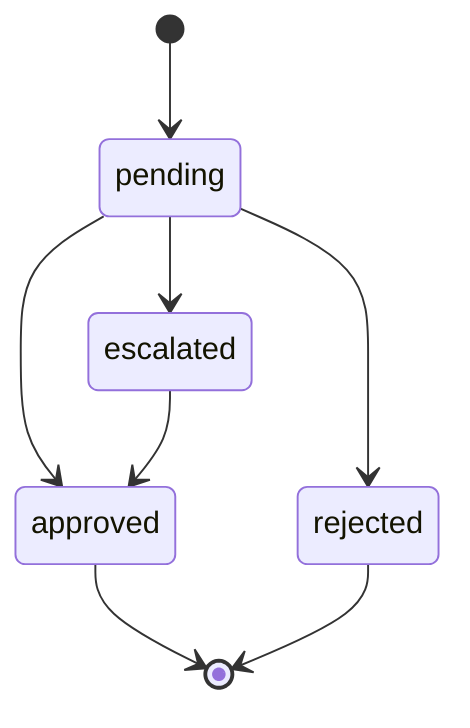

````markdown
# ECONEURA · Control plane de IA para empresas  
**Gestiona IA sobre tu <sistema>. No sustituimos ERP/CRM.**

[](#)
[](#)
[](#)
[](#)

ECONEURA opera agentes de IA sobre tus sistemas actuales con gobierno integrado: HITL, DLP, FinOps y evidencias. EU-first, auditable y con costes previsibles.

---

## TLDR
- No sustituimos ERP, CRM ni HRIS. Orquestamos IA sobre tu stack.  
- Cockpit con 10 areas y 5 agentes por area.  
- Cumplimiento y control: HITL, DLP, RLS, FinOps y observabilidad OTel.  

---

## Demo local en VS Code
```bash
corepack enable
pnpm -v || npm i -g pnpm@8.15.5
pnpm -w install --frozen-lockfile
pnpm -C apps/web dev
# VS Code → View: Simple Browser → http://localhost:3000
````

---

## Que es

* **Cockpit web**: sidebar por area, grid de agentes, consumo IA, KPIs, timeline y chat.
* **Agentes**: ejecucion con barra de progreso y ETA.
* **Gobierno**: aprobaciones HITL, politicas DLP y limites FinOps.
* **Observabilidad**: OTel end to end y alertas de salud.

---

## Arquitectura

```mermaid
flowchart LR
  User-->Cockpit[apps/web]
  Cockpit--->API[apps/api (proxy IA)]
  API--PG-->DB[(Postgres + RLS)]
  API--OIDC-->AAD[(AAD OIDC)]
  API--OTLP-->OTel[(OTel Collector)]
  API--Make-->Make[Make.com]
  API--Models-->LLM[(Modelos on-prem y cloud)]
```

---

## Cockpit: capacidades

* **Navegacion por areas**: CEO, IA, CSO, CTO, CISO, COO, CHRO, CGO, CFO, CDO.
* **Agentes**: estado activo, progreso, ETA, consumo IA y botones Ejecutar, Pausar, Conectar Make.
* **KPIs rapidos** por area.
* **Timeline** con eventos ok, warn, err.
* **Chat** por area con sugerencias rapidas y accesibilidad aria.
* **Mensaje fijo de marca**: Gestiona IA sobre tu stack. No sustituimos ERP/CRM.

Capturas sugeridas:

* `docs/img/cockpit.png`
* `docs/img/hitl.png`
* `docs/img/finops.png`

---

## Gobierno: HITL, DLP, FinOps

### HITL



* Aprobacion por rol.
* Auditoria con marca temporal y usuario.
* Escalado y reintento controlado.

### DLP

* Deteccion de NIF, DNI, IBAN, email personal.
* Enmascarado, listas permitidas, bloqueo y log.
* Politicas por tenant y por canal.

### FinOps

* Presupuesto por tenant y por agente.
* Limites diario y mensual con hard stop.
* Metricas base: EUR por tarea p95 y ratio de fallbacks.
* Alertas por variacion de consumo y por cuota alcanzada.

---

## Observabilidad y SLO

* Export OTLP a App Insights, Tempo o similar.
* Correlacion con X-Correlation-Id.
* Alertas recomendadas:

  * p95 > 1500 ms
  * 5xx > 5 por minuto
  * disponibilidad < 100 por ciento

---

## API minimas

```
GET  /v1/health
POST /v1/chat            { model, messages[] } -> { text }
POST /v1/agents/:id/run  -> 202
GET  /v1/usage           -> consumo por agente y tenant
```

---

## Calidad y CI

* Cobertura consolidada objetivo:

  * statements >= 90 por ciento
  * functions >= 80 por ciento
* Lint sin warnings, typecheck estricto, artefactos reproducibles.

Comandos utiles:

```bash
pnpm -C apps/web lint --max-warnings 0
pnpm -C apps/web typecheck
pnpm -C apps/web test:coverage
```

---

## Seguridad UE

* Datos en la UE. TLS 1.2 o superior.
* Cifrado en transito y en reposo.
* RLS por tenant y minimizacion de datos.
* Auditoria de accesos a PII y de decisiones HITL.
* Sin secretos en el cliente. Proxy de servidor para IA.

---

## Guia de desarrollo

1. Instala dependencias con pnpm.
2. Arranca `apps/web`.
3. Configura `AI_ENDPOINT` en servidor proxy y el modelo en API.
4. No subas `.env*` ni datos PII.
5. Ejecuta lint, typecheck y cobertura antes de abrir PR.

Estructura abreviada:

```
apps/
  web/
  api/
policies/
db/
otel/
openapi/
scripts/
tools/codemods/
```

---

## Roadmap breve

* Integraciones Make y Azure listas para produccion.
* Cuotas FinOps y alertas en tiempo real por agente.
* MSAL y RBAC por rol y area.
* Dashboards OTel y SLO documentados.
* Playwright E2E critico y p95 UI menor a 2 s.

---

## Contribucion

* Ramas: `feat/*`, `fix/*`, `chore/*`.
* PR con: cambios, riesgos HITL y FinOps, capturas, cobertura y p95.
* Estilo: ESLint y Prettier, cero warnings.

---

## FAQ

**¿Sustituye mi ERP o CRM?** No. Orquesta IA sobre tu stack.
**¿Donde se procesan los datos?** En la UE segun despliegue acordado.
**¿Que modelos se usan?** Cloud u on-prem. Sin bloqueo de proveedor.
**¿Como controlo costes?** Limites por agente y por tenant y EUR por tarea p95.

---

## Licencia

Definir antes de produccion. Sugeridas: Apache 2.0 o Business Source con anexos de uso responsable.

---

**ECONEURA** · **Gestiona IA sobre tu <sistema>. No sustituimos ERP/CRM.**

STATUS: mixto · long≈medio · claimsExt=N · faltantes=S (capturas reales, ejemplos de politicas DLP y FinOps en repo).

```
```
